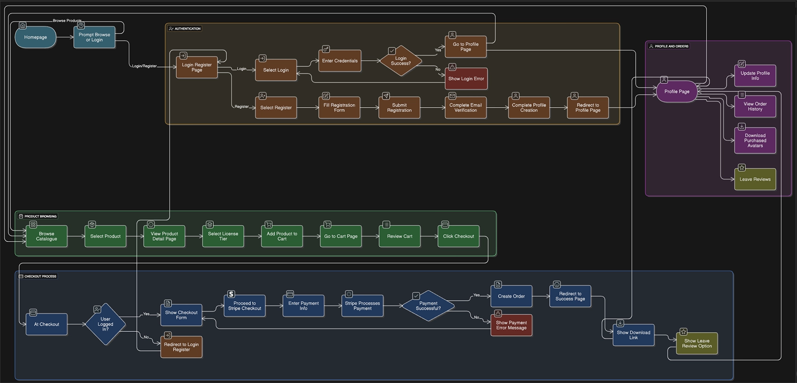

# Avagen - User Flow Chart

This diagram illustrates the user journey and application flow for the Avagen digital avatar marketplace.

## Flow Description

The flowchart shows the complete user experience from initial site visit through to purchase completion and account management. Key user paths include:

- **Site Visitor Flow**: Browse products, view details, add to cart
- **Registration Flow**: Sign up, email verification, profile creation
- **Purchase Flow**: Cart management, checkout, payment processing
- **Account Management**: Profile updates, order history, downloads
- **Admin Functions**: Product management, user administration

---

[← Back to README](README.md) 