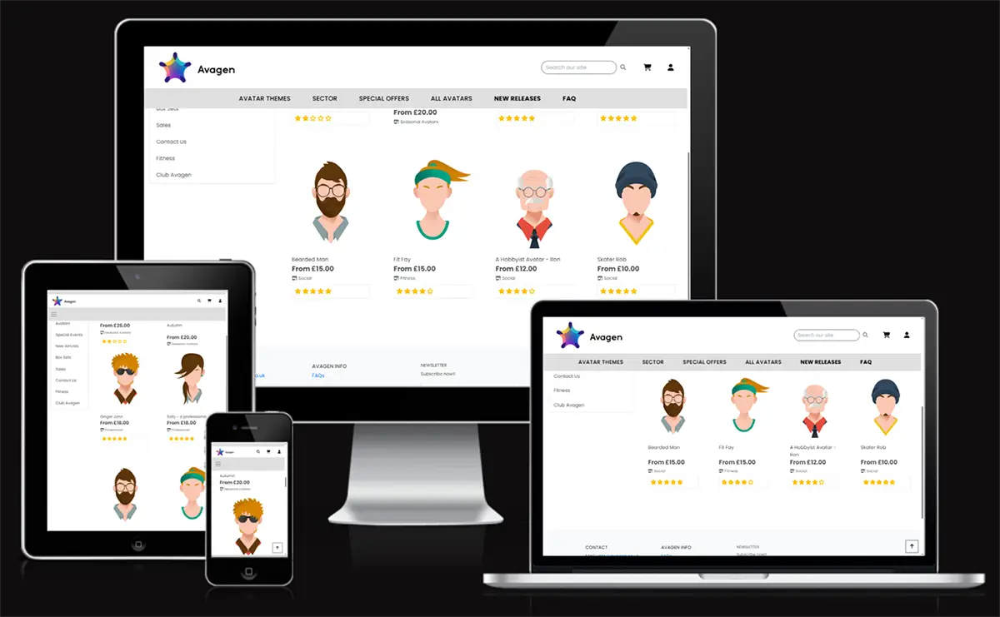
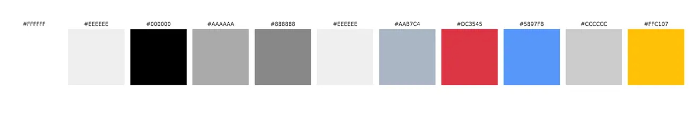
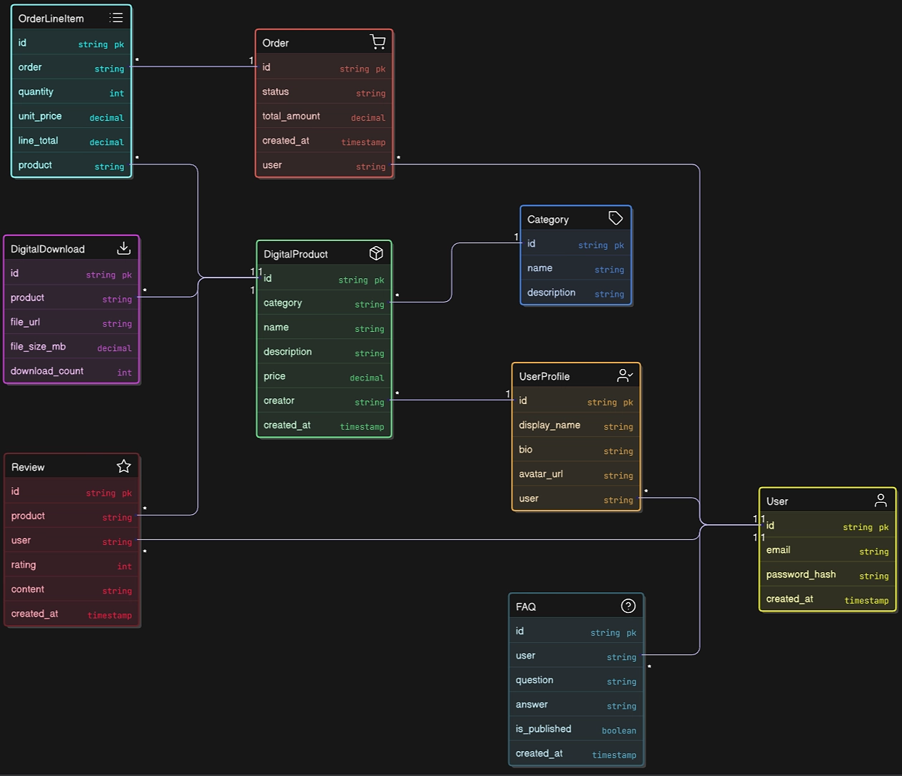
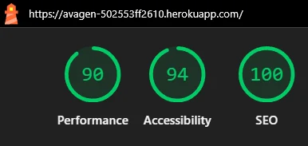

## Avagen 


<a href="https://avagen-502553ff2610.herokuapp.com/" target="_blank">**Avagen – Live Site**</a> 



## About

**Avagen** is a digital concept store for the next generation of online creators, gamers and explorers. It lets you **browse, purchase and immediately download** high‑quality, digitally crafted avatars to represent your online identity across games, social platforms and virtual worlds.

The platform is built with **Django 5**, **PostgreSQL** and **Stripe** to provide a secure, scalable and fully‑featured e‑commerce experience while keeping content‑creators and end‑users front‑of‑mind.

### Why Avagen?

* **Creators first** – Upon purchase and download, both creators and metaverse users can immediately assign their selected avatar to their profile for use across supported platforms.
* **Instant delivery** – every purchase is a digital download as a ready‑to‑use PNGs in a zipped file.
* **Cross‑platform licensing** – a single licence grants customers the right to reuse the avatar across games, socials and the open metaverse.

---

### Target Users

| User (Persona)            | Needs                                                 |
| ------------------------- | ----------------------------------------------------- |
| **Gamers & streamers**    | Original in‑game skins & digital profile                                          |
| **All users**             | Anyone aged 16+ or older, of any gender, who loves social media and gaming.        |
| **Influencers & VTubers** | A recognisable digital persona that travels with them        |
| **Everyday web users**    | Anonymity & security without sacrificing style               |
| **Hobbyists**             | Users using avatars to add to their profiles for recreation  |
---

### Business / Revenue Model

- **Direct Avatar Sales**: Revenue is generated per avatar purchase, with prices tiered by license type (*Personal*, *Indie*, *Professional*).

- **Tiered Licensing**: Customers pay more for broader usage rights (e.g., for commercial content, streaming, branding). Refer to <a href="LICENSE.md" target="_blank">LICENSE.md</a> detailing the License Tiers.

- **Newsletter Promotions**: Sales and launches are marketed through an integrated newsletter system.

- **Creator-Friendly Terms**: A portion of revenue is directed toward avatar designers *(future feature roadmap)*.


## Key Features

### Features

Avagen is a full-stack Django web application designed for selling digital products. Built with Python, Django, HTML, CSS, and JavaScript, it emphasizes responsive design, secure digital delivery, and user-friendly interfaces. The platform includes admin tools, SEO optimisation, and Stripe integration for a seamless checkout experiences.

- **Catalogue**
  - Responsive product grid layout optimised for all screen sizes.
  - Displays high-quality product thumbnails.
  - Filter products by theme or price range.

- **Product Detail**
  - High-resolution image gallery on each product page.
  - License drop down selector - License terms displayed clearly: Personal, Indie, or Professional.
  - Detailed product descriptions before checkout.
  - Detailed product specifications and price breakdown before purchase.
  - Average star rating and customer reviews displayed beneath the product descriptions.

  **Reviews & Ratings**
   - Authenticated users can leave 1–5 star reviews with optional comments.
   - Average rating is calculated on‑the‑fly and displayed for performance.
   - Catalogue can be sorted by rating to surface the most popular avatars.

- **Cart & Checkout**
  - Add products (with chosen licence) to cart and adjust quantities inline.
  - Optimised for mobile and desktop devices.
  - Verified Stripe webhooks finalise orders.
  - Fully responsive checkout pages optimised for mobile and desktop.
  - Users can sign in directly from the cart page.
  - If signed in, previous address and order history are autofilled.

- **Digital Delivery**
  - Download links shown immediately after successful payment.
  - Order history includes access to previously purchased downloads.
  - Instant and secure delivery of digital products.
  - Purchased digital products are downloadable from the registered user's account. The downloads are resumable. Lifetime access to them is granted.

- **User Accounts**
  - Built using the django-allauth third-party package for robust user authentication.
  - Users can register, log in, and manage their orders easily.
  - Users can update their profile information, i.e Phone number, Address, Postcode and County and Country.
  - Includes a "Download Again" page for users to re-download past purchases.

- **Profile**

  - A dedicated profile page shows the user's personal and address information.
  - Users can edit their contact details and delivery address.
  - Users can upload a profile photo for their dedicated profile page.
  - View a timeline of previous orders, including date and items purchased. Additional information includes license level, a model number and total paid.
  - Profile section includes password reset and account deletion options.
  
- **Manage Products** 
  - Full CRUD functionality accessible from the top right corner of the site.
  - Admins and superusers can manage products through a frontend form, in addition to Django Admin:

- **Add New Products** via a simple, user-friendly form

- Input fields for:

  -  Category  (dropdown)
  -  Name of item
  -  Description (rich text)
  -  Base Price  
  - `Image URL` or upload using  `Select Image`
  - Status (*Draft* or *Published*)
  - Upload images directly or paste hosted links 
  - `Cancel` or `Add Product` buttons

- **Newsletter Signup**
  - Users can subscribe using their first name, last name, and email.
  - Supports email marketing integrations (e.g., Mailchimp or SMTP).

- **Newsletter Subscribers**: Manage email subscriptions with first name, last name, and email.
- **Newsletter Creation**: Create newsletters with title, subject, and content.
- **Admin Interface**: Full admin interface for managing subscribers and newsletters.
- **Welcome Emails**: Automatic welcome emails sent to new subscribers.

- **Admin / Superuser Dashboard**
  - Django Admin interface for product and category management.
  - Full CRUD functionality for superusers.
  - Restricted content visibility by user tier. 
  - Superusers and administrators have access to the Django Interface. They can delete and edit products on the products & products detail page.
  
  **Search Bar**
   - Instant, keyword-based search.
   - Helps users quickly find products by name, model, or relevant terms.

- **SEO Optimisation**
  - Custom, SEO-optimised meta tags implemented on essential pages.
  - Clean, readable URLs.
  - Custom 404 error page for better user experience and site crawlability.
  - Optimised meta tags applied to key pages for enhanced search engine indexing.
  
  **Performance** 
  - WhiteNoise serves compressed static assets; Cloudinary transforms images on‑the‑fly for smaller payloads.


## How to Use Avagen - A brief walkthrough.

1. **Register** – click *Sign‑up*, enter your email address username and password.
2. **Login** - Login with your username or email and input your password.
2. **Explore avatars** – filter by theme (Personalised, Artistic, Seasonal or Special Events, etc.) or sort by price / rating.
3. **Add to cart** – adjust quantity or remove items directly from the mini‑cart.
4. **Click on cart symbol to see a cart total** - adjust quantity or remove from the cart page and checkout. 
5. **Checkout** – sign in from the cart page. Then fill in billing info and pay securely via Stripe.
6. **Download** – use the *Download* button on the success page or from *My Orders* at any time.
7. **Manage account** – change personal info, view order history, re‑download files or delete your account.


## UX & Design


 **Wireframes**  [View Wireframes](WIREFRAMES.md)  
 **Flowchart**   [View Flow Chart](FLOWCHART.md)   

### Logo & Brand Identity


The Avagen logo represents the brand's focus on digital identity creation. It is futuristic and colourful.  
The logo communicates that Avagen is a forward-thinking brand centered on empowering users to create unique digital personas.

## Colour Palette



The Avagen site uses a clean, minimal layout with a palette of soft neutral colours for backgrounds and sections. Bold, vibrant colors like blue (#007BFF), yellow (#FFC107), and raspberry (#D72660) are used for buttons and key actions, making them stand out and easy to find. This approach keeps the interface simple and readable while clearly guiding users to important features.
Typography is modern and easy to read, with Inter for body text and Space Grotesk for headings. The design stays consistent and clear on all screen sizes, creating a smooth and enjoyable user experience.

## Agile Process

Project tasks were tracked in **GitHub Projects** (Kanban). Each card contained a *user story* with acceptance criteria and links to the relevant pull request.
Check the User Stories on Github here: [GitHub Kanban Board](https://github.com/users/IsaHu-dev/projects/14)

## User Stories
                

### Site Visitor

| As a / an     | I want to be able to:                                      | So that I can:                                                        |
|---------------|------------------------------------------------------------|------------------------------------------------------------------------|
| Site Visitor  | Browse a list of available products                        | Choose items to purchase                                               |
| Site Visitor  | Filter products by category                                | Quickly find items that match my interests without browsing everything |
| Site Visitor  | View detailed information about individual products        | Understand their price, description, ratings, images, and sizes        |
| Site Visitor  | See a running total of my purchases                        | Keep track of how much I'm spending while shopping                     |
| Site Visitor  | Preview avatars before buying                              | Browse 12 avatars per page, quickly explore individual ones            |

---

### Registrations and User Accounts

| As a / an     | I want to:                                     | So that I can:                                                          |
|---------------|------------------------------------------------|--------------------------------------------------------------------------|
| Site User     | Create an account quickly and easily           | Access my personal profile                                               |
| Site User     | Log in and log out effortlessly                | Manage my account securely                                               |
| Site User     | Reset my password if I forget it               | Regain access to my account                                              |
| Site User     | Receive a confirmation email after signing up  | Know my registration was successful                                      |
| Site User     | Have a custom user profile                     | See past orders, upload profile photo, change password and save my details   |
| Authenticated User | Delete my account                         | Access my profile page to delete my account                              |
| Authenticated User | Download my past purchases again anytime | Re-access previously bought content easily                                |
| Authenticated User | Download my past purchases again anytime | Re-access previously bought content easily                                |


### Sorting and Searching

| As a / an               | I want to:                                                              | So that I can:                                                                 |
|------------------------|--------------------------------------------------------------------------|---------------------------------------------------------------------------------|
| Site Visitor           | Sort the list of available products                                     | Identify best rated, best priced, or category-specific items                   |
| Shopper (category)     | Reorder items by price, popularity, or name                             | Prioritize what's most relevant to me                                          |
| Site User              | Apply sorting across different categories                               | Compare options across the whole catalog                                       |
| Online Shopper         | Organise product listings by rating, price, or category                 | Easily compare and choose the right one                                        |
| Site User              | Search for specific items using keywords                                | Locate exactly what I have in mind without browsing endlessly                  |

---

### Admin & CMS Functionality

| As a / an            | I want to:                                                         | So that I can:                                                                   |
|----------------------|--------------------------------------------------------------------|-----------------------------------------------------------------------------------|
| Superuser / Admin    | Dynamically update the "New Releases" section                      | Ensure it stays current without editing code                                      |
| Admin / Superuser    | Upload product files and assign them to specific items             | Attach ZIP files for download based on product name and model number             |
| Admin / Superuser    | Make products temporarily invisible without deleting them          | Edit the product without publishing it                                           |
| Admin                | Manage products, categories, and users easily                      | Perform full CRUD in Django Admin with access control                            |

---

### Additional Features

| As a / an             | I want to:                                                   | So that I can:                                                                  |
|-----------------------|--------------------------------------------------------------|----------------------------------------------------------------------------------|
| Site Visitor          | Subscribe to a newsletter for updates                        | Receive new product alerts and special offers                                   |
| Developer / SEO       | Have search engines properly index the site                  | Improve site visibility with sitemap, robots.txt, and structured meta tags      |

---

| Role                  | Story                                                             | Acceptance Criteria                                                                 |
|-----------------------|-------------------------------------------------------------------|--------------------------------------------------------------------------------------|
| Site Visitor          | View detailed information about individual products              | Product detail pages show title, description, price, reviews, images, and licences |
| Site Visitor          | Filter products by category                                       | Category filters return results instantly without page reload                       |
| Site Visitor          | See a running total of my purchases                              | Cart updates total price dynamically as items are added or removed                  |
| Site Visitor          | Preview avatars before buying                                     | Index page loads in <3s, displays 12 avatars/page, and links to details             |
| Site User             | Receive a confirmation email after signing up                    | Confirmation email sent immediately after signup                                    |
| Site User             | Log in and log out effortlessly                                   | Actions complete without error and redirect properly                                |
| Site User             | Reset my password if I forget it                                  | Reset email arrives within 1 minute and enables full recovery                       |
| Site User             | Have a custom user profile with order history                    | Profile shows orders, licence details, and editable info                            |
| User (searching)      | See what I searched for and how many matches were found          | Search term is echoed and total result count is displayed                           |
| Online Shopper        | Organize product listings by rating, price, or category          | Sorting updates product grid without refreshing the page                            |
| Shopper (category)    | Reorder items in a category by price, popularity, or name        | Sort dropdowns apply within filtered view and update grid                           |
| User (cross-category) | Apply sorting across different categories                        | Sorting persists when navigating categories                                         |
| Site Admin            | Dynamically update "New Releases" from admin panel               | Navbar updates with admin dashboard changes                                        |
| Authenticated User    | Download my past purchases again anytime                         | Users see order history with download links                                         |
| Admin / Superuser     | Upload product files and assign them to items                    | Upload ZIPs in admin and map to product name & model number                         |
| Admin / Superuser     | Make products temporarily invisible                              | Toggle product status between live and draft                                        |
| Visitor               | Subscribe to a newsletter                                        | Signup form stores name/email for Mailchimp or SMTP integration                     |
| Developer / SEO       | Ensure search engines index the site properly                    | Sitemap.xml, robots.txt, and meta tags are present and auto-generated               |
| Admin                 | Manage products, categories, and users                           | Full CRUD on web frontend and via Django Admin with role-based access                                   |
            
[Go to the Kanban Board](https://github.com/users/IsaHu-dev/projects/14)

## Models 

### Custom Models 

The application includes five custom models across modular apps, each written manually custom models to address the needs of the user, site owner and online shopper:

1. ### `Review` Model
- Connected to `User` and `Product` via foreign keys.
- Stores `rating` (1–5 stars), `comment`, and a `created_on` timestamp.
- Prevents duplicate reviews per user/product using model-level constraints.
- Includes logic for calculating average product ratings.

2. ### `Catalogue` Models

The catalogue app is responsible for: 

- Associating **digital downloads** with products.
- Allowing **authenticated users** to access downloads after purchase or review.
- Enabling **admins** to upload downloadable content via Django Admin.

**DigitalDownload**

Stores downloadable files for each product.

**Fields:**
- `product`: ForeignKey to `Product`
- `file_url`: Link to file (links product files to secure Google Cloud Storage URLs).
- `uploaded_at`: Timestamp

- Download access is restricted to users who've completed a purchase.

3. ### `Newsletter Subscriber` Model
- Stores `first_name`, `last_name`, and `email` fields.
- Designed to work with external marketing tools like Mailchimp or SMTP.
- Built manually, allowing full control over form handling and integration.

```python
class Subscriber(models.Model):
    first_name = models.CharField(max_length=50)
    last_name = models.CharField(max_length=50)
    email = models.EmailField(unique=True)
    subscribed_on = models.DateTimeField(auto_now_add=True)
```

4. ### `FAQ` Model

The FAQ model is designed to store frequently asked questions along with their answers. 

- Question & Answer structure
- Optional user association (via `ForeignKey`)
- Auto timestamp for creation date
- Admin-friendly metadata (ordering, verbose names)

The model has two main fields:

- `question`: A `CharField` used to store the text of the question.  
  `max_length=255` restricts it to 255 characters.

- `answer`: A `TextField` for storing the full answer or explanation.  
  This allows long-form content.

 **Optional User Association**

```python
user = models.ForeignKey(
    settings.AUTH_USER_MODEL,
    on_delete=models.CASCADE,
    null=True,
    blank=True
)
```
5. ### `Product` Model
- Core model with `name`, `description`, `model_number`, `base_price`, and Cloudinary images.
- Displays a list of all available products.
- Includes a `slug` field for SEO-friendly URLs.
- `base_price` Contains methods for dynamic pricing that is incremental from the base price. Returns price for `Personal`, `Indie`, or `Professional` licenses.
- `is_live` controls products storefront visibility (draft or published).
- Cloudinary used for optimised media storage.

**Category**
- Self-referencing `parent` field for hierarchical structure.
- Supports nested categories for advanced product filtering.

**LicensePrice**
- Stores multipliers for Personal, Indie, and Professional licenses.
```
class Product(models.Model):
    name = models.CharField(max_length=120)
    slug = models.SlugField(unique=True)
    model_number = models.CharField(max_length=20)
    description = models.TextField()
    base_price = models.DecimalField(max_digits=8, decimal_places=2)
    image = CloudinaryField('image')
    is_live = models.BooleanField(default=False)
```

## Technologies Used

* **Backend** – Python 3.13, Django 5, Django‑Allauth, Stripe SDK
* **Database** – PostgreSQL 16, AWS RDS (production)
* **Frontend** – HTML5, CSS3, Bootstrap 5, JavaScript, jQuery for some DOM manipulation
* **Dev‑Ops** – GitHub and Heroku
* **Testing** – `pytest`, Lighthouse, W3C validators, Black.

## Database Schema 



## Deployment

 The application was deployed with Heroku. The following preparatory steps are as follows:
  1. Set Debug Mode to False. In settings.py, the DEBUG setting was set to False to ensure a production-ready environment.
  2. A Procfile document is defined. web: gunicorn avagen_main.wsgi.
  3. Store Dependencies - All required dependencies were documented in requirements.txt using: pip3 freeze --local > requirements.txt.
  4. Create a New Heroku App. 
    - Log in to the Heroku dashboard.
    - Click New > Create New App.
    - Enter a unique app name.
    - Click Create App.
  5.  Configure Application Settings
    - Navigate to the Settings tab.
    - In the Config Vars section, add the required environment variables:
      - Database_URL
      - DJANGO_SECRET_KEY
      - Cloudinary_Cloud_Name
      - Cloundinary_API_Key
      - GCS_KEY_BASE64 - Import the text file (Taken from the gcs-service-key.json from Google Storage)
      - Stripe_Public_key, Stripe Secret Key and the Stripe Webhook Secret key. 

    - Add the Heroku/Python buildpack.
  6.  Install Whitenoise for Heroku to serve static files / images on Heroku.
      - Setting Up Whitenoise for Static Files in Heroku

    - pip install whitenoise

    Add to settings.py: 

    MIDDLEWARE = [
         "whitenoise.middleware.WhiteNoiseMiddleware",
    ]

    STATIC_URL = "/static/"
    STATIC_ROOT = BASE_DIR / "staticfiles"  # Heroku serves from this folder
    STATICFILES_STORAGE = "whitenoise.storage.CompressedManifestStaticFilesStorage"

  7. Connect to GitHub Repository.
      -  In the Deploy tab, under Deployment Method, select GitHub.
      -  Follow the steps to authorise and connect your GitHub account.
      -  Search for the repository and click Connect.
  8.  Deploy the Application.   
      -  Select manual deployment
      -  In the Manual Deploys section, select a branch and click Deploy Branch.
  9.  Access the Live Application.
      -  Once the deployment is complete, an app link is generated. The live application can be accessed at <a href="https://avagen-502553ff2610.herokuapp.com/" target="_blank">Avagen App</a>
   ```
4. Upload media files to Google Cloud Storage 3.1.0


## Local Installation

```bash
git clone https://github.com/IsaHu-dev/Avagen_v1.git
cd Avagen_v1
python -m venv venv
source venv/bin/activate   
pip install -r requirements.txt
cp .env.example .env        
python manage.py migrate
python manage.py runserver
```

#### Browse to [http://127.0.0.1:8000](http://127.0.0.1:8000).
---

## Manual User Testing


| Area              | Action                                   | Expected Result                                                           | Status |
| ----------------- | ---------------------------------------- | ------------------------------------------------------------------------- | ------ |
| **Registration**  | Submit form with valid input             | Redirect to Dashboard, confirmation email sent                            | ✅     |
|                   | Click email verification link            | Email verified, account fully activated                                   | ✅     |
|                   | Check inbox after registration           | Verification message received with activation link                        | ✅     |
|                   | Submit mismatched passwords              | Form errors shown, account not created                                    | ✅     |
| **Login**         | Valid credentials                        | Redirect to dashboard, session starts                                     | ✅     |
|                   | Invalid credentials                      | Error message shown                                                       | ✅     |
| **Catalogue**     | Visit home page                          | 12+ products visible, filter sidebar available                            | ✅     |
|                   | Use search or filters                    | Grid updates with matching items                                          | ✅     |
| **Product Page**  | Click on product card                    | Redirect to detail page, preview gallery visible                          | ✅     |
|                   | Click "Add to Cart"                      | Item added to cart, page redirects with success message                   | ✅     |
|                   | Superuser: Click "Edit" or "Delete"      | Redirects to form or confirms deletion                                    | ✅     |
| **Cart**          | Adjust quantity                          | Cart subtotal updates without page reload                                 | ✅     |
|                   | Remove item                              | Item removed, cart total recalculates                                     | ✅     |
| **Checkout**      | Fill form with Stripe test card          | Payment succeeds, redirect to success page                                | ✅     |
|                   | Cancel checkout                          | Return to cart, no order created                                          | ✅     |
| **Delivery**      | Download from success page               | ZIP or file download starts                                               | ✅     |
|                   | Download from past orders                | File re-downloads without issues                                          | ✅     |
| **Profile**       | Edit account info                        | Name/email updates can be changed at any time                             | ✅     |
|                   | Edit user bio and display name           | Bio and display name saved and shown on profile page                      | ✅     |
|                   | Upload profile image                     | Image saved and rendered with custom widget                               | ✅     |
|                   | Fill address fields                      | Address details saved.                                                    | ✅     |
|                   | Delete account                           | Data removed, user logged out                                             | ✅     |
|                   | Order History displayed                  | Order number, date, item, model number, license level and total paid is displayed.                                              | ✅     |
| **Mobile**        | Navigate on iPhone SE / Galaxy S8        | Layout responsive, navbar collapses correctly                             | ✅     |
| **Accessibility** | Navigate with keyboard                   | All interactive elements are reachable                                    | ✅     |
| **Admin**         | Upload ZIP file to product               | File is linked and downloadable post-purchase                             | ✅     |
| **Admin**         | Toggle product live/draft                | Visibility updated without deleting the product                           | ✅     |
| **Admin**         | Use 'Is Creator' checkbox                | Categories appear in 'New Releases' dropdown in main navigation bar       | ✅     |
| **Search**        | Use keyword search bar                   | Matching products shown from the keyword search                           | ✅     |
| **Newsletter**    | Submit email on signup form              | Confirmation message shown or email stored in database                    | ✅     |
| **Newsletter**    | Subscribe with valid email and name      | Welcome email is received (check inbox/spam)                              | ✅     |
| **Newsletter**    | Subscribe with duplicate email           | Error message popup shown, no duplicate entry created                     | ✅     |
| **Newsletter**    | Admin views subscribers in admin panel   | Subscriber list is visible, can search/filter/delete                      | ✅     |
| **Newsletter**    | Welcome email uses correct name          | Email greets user by their first name as entered on sign up               | ✅     |


| Area              | Action                                               | Expected Result                                                              | Status |
| ----------------- | ---------------------------------------------------- | ---------------------------------------------------------------------------- | ------ |
| **Admin**         | Upload product image via admin                       | Image is saved and visible in preview thumbnail                             | ✅     |
| **Admin**         | Upload ZIP file to product                           | File is linked and downloadable post-purchase                               | ✅     |
| **Admin**         | Use 'Is Creator' checkbox in Category                | Category appears in 'New Releases' or creator-specific dropdowns            | ✅     |
| **Admin**         | Toggle product between 'Draft' and 'Published'       | Product visibility updates across site without being deleted                | ✅     |
| **Admin**         | Mark selected as Draft                               | Selected products are set to 'draft' status and disappear from public view  | ✅     |
| **Admin**         | Mark selected as Published                           | Selected products are live and visible on the site                          | ✅     |
| **Admin**         | Edit model_number field (visible for superusers only)| Superuser sees and can update the model_number field                        | ✅     |
| **Admin**         | Check readonly timestamps (created_at, modified_at)  | Fields are visible but cannot be edited manually                            | ✅     |
| **Admin**         | Verify search by name, description, model_number     | Matching products appear in the admin list view                             | ✅     |
| **Admin**         | View image preview in admin list                     | Thumbnail preview appears in image_preview column                           | ✅     |
| **Admin**         | Manage Products - Fill out the custom product form and submit          | Product is created and visible in the admin/storefront                    | ✅     |
| **Admin**         | Manage Products - Upload image using file input                        | Image is accepted and preview is visible (if supported)                   | ✅     |
| **Admin**         | Manage Products - Submit form with missing required fields             | Error messages appear, product is not created                             | ✅     |
| **Admin**         | Manage Products - Set status to Draft and submit                       | Product is saved but hidden from the storefront                           | ✅     |
| **Admin**         | Manage Products - Set status to Published and submit                   | Product is saved and shown in the storefront                              | ✅     |


### Testing Status


* **Manual Testing**: ✅ Comprehensive manual testing completed.
* **Python**: Passed CI Python Linter.
* **HTML/CSS**: Passed W3C validators - "Congratulations! No Error Found."
* **Javascript**: Passed Jshint validator.
* **Lighthouse (Google Chrome DevTools)**: High score on Lighthouse for Performance, Accessibility & SEO.



---

## Known Issues / Future Work

* **Avatar builder** - create an interactive avatar builder
* **Marketplace payouts** – migrate to Stripe Connect Express for automated royalties

---
## Resources

- Stack Overflow - Reference for Code Snippets. 
- Code Institute - Boutique Ado served as a starting point for learning and planning, but all logic, views, and components in Avagen have been developed independently. The codebase has been fully rewritten and customised for this project.
- [Django Documentation](https://docs.djangoproject.com/en/3.2/)
- [DjangoGirls Tutorial](https://tutorial.djangogirls.org/)
- [How to Send Email in Django (Real Python)](https://realpython.com/django-send-email/)
- [Django Signals: Real Python](https://realpython.com/django-signals/)
- [Eraser.io - Database scheme ](https://www.eraser.io/) Inserted SQL input into the Eraser web interface to generate the Database Schema.

## Credits

| Resource                      | Usage                                   |
| ----------------------------- | --------------------------------------- |
| **Envato**                            | Base image elements for some sample avatar packs   |
| **Stylised Character Avatar images**  | Created by the owner of Avagen - Isa Hu      |                  

---

## Software License

All code is released under the **[MIT License](https://opensource.org/licenses/MIT)**.

## Acknowledgements
 
 - Thanks to the mentor programme at Code Institute with Moritz Wach.


