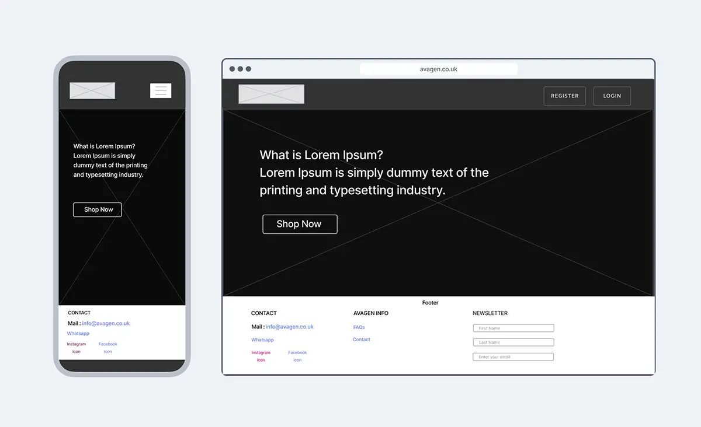
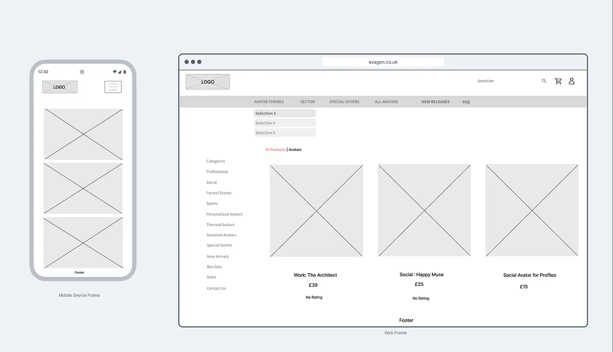
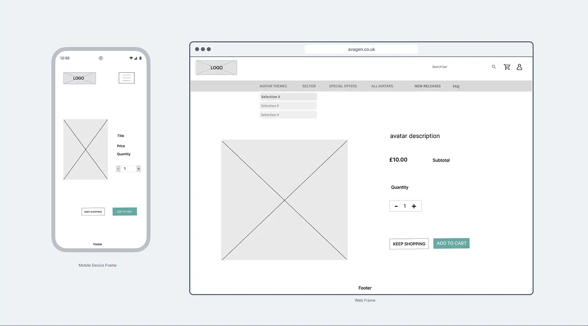
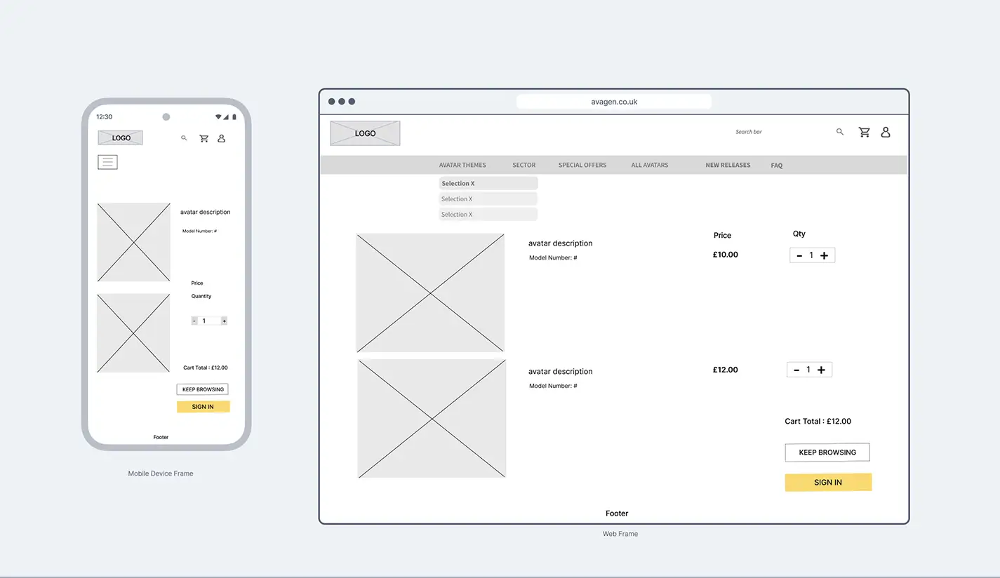
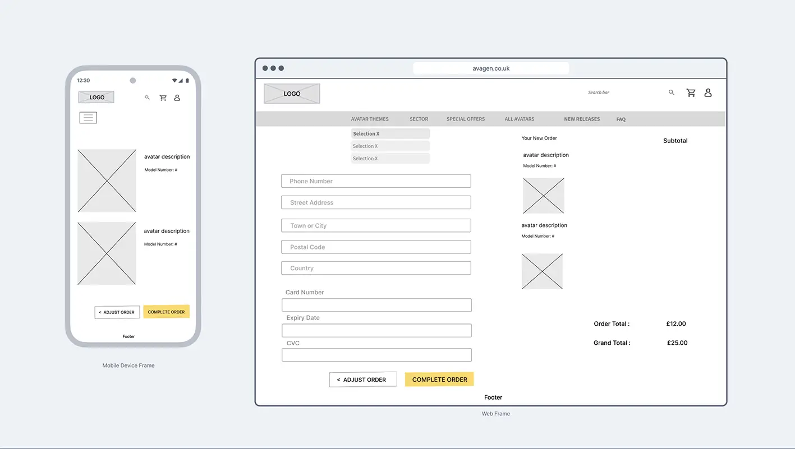
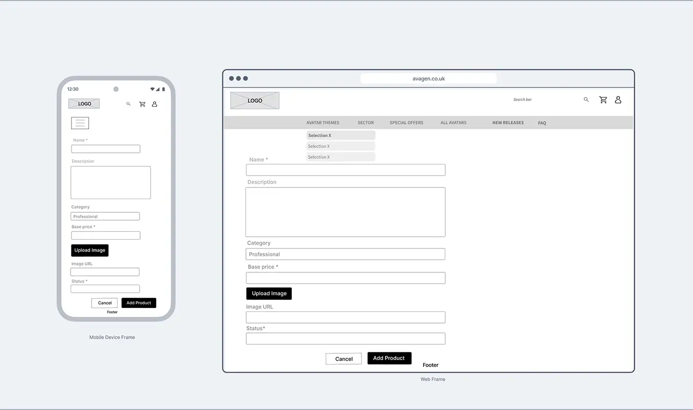

# Avagen - Wireframes

This document showcases the wireframes and design mockups for the Avagen digital avatar marketplace. These wireframes were created during the initial planning phase to visualize the user interface and user experience before development began.

## Wireframe Overview

The wireframes demonstrate the key user interfaces and user flows for the Avagen platform, focusing on the e-commerce experience for purchasing digital avatars.

---

## Home Page / Index

## Products Catalogue

## Product Details

## Shopping Cart

## Checkout Process

## Product Management

[← Back to README](README.md) 